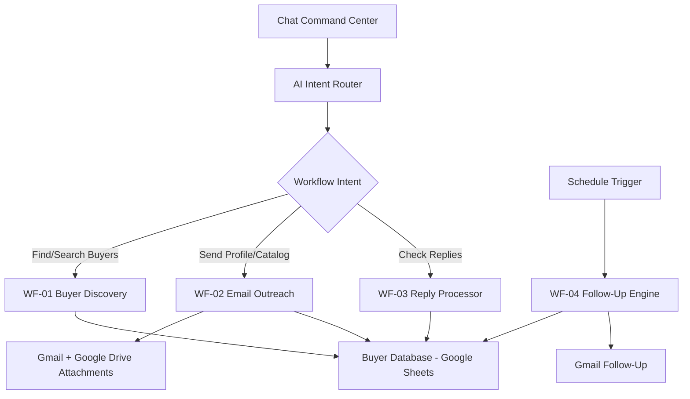

# Export Marketing Automation Workflow

[](https://n8n.io/)
[](https://openai.com/)
[](https://www.google.com/sheets/about/)
[](https://www.google.com/gmail/)
[](https://www.google.com/drive/)
[](#architecture)
[](#license)

An n8n-based automation blueprint for export marketing operations: buyer discovery, lead storage, company profile outreach, reply classification, and scheduled follow-up management.

This repository is designed as a public-safe project package. It does not include credentials, API keys, OAuth tokens, private spreadsheet URLs, or live workflow exports.

## What This Project Does

The system helps an export business manage buyer discovery and outreach from a single n8n chat command center.

Core capabilities:

- Discover potential buyers, importers, distributors, wholesalers, and commodity traders.
- Save qualified leads into a Google Sheets buyer database.
- Send company profile and product catalog emails to selected buyers.
- Monitor buyer replies and classify interest level.
- Update buyer status automatically.
- Run follow-up automation on a separate schedule.

## Architecture



## Workflows

### EXPORT MARKETING COMMAND CENTER

The chat-based router. It interprets user commands and executes the closest matching workflow.

Example commands:

```text
Find buyers of cloves in Turkey
Find 3 black pepper importers in Germany
Search coffee distributors in Italy and add to spreadsheet
Send profile to Turkey buyers
Check email replies
```

If the user asks for buyer discovery without a product or industry, the command center asks for clarification instead of running a broken search.

### WF-01 Buyer Discovery

Finds buyer leads from internet resources and saves them to Google Sheets.

Default behavior:

- If the user does not specify a count, find up to 10 buyers.
- If the user specifies a count, respect that count.
- Prioritize leads with at least company name and email.
- Save new leads with status `No Action`.

### WF-02 Email Outreach

Reads buyers with `Status = No Action`, generates a short personalized opener, sends the company profile and product catalog, then updates the buyer status.

### WF-03 Reply Processor

Checks buyer replies, classifies the buyer status, and updates the spreadsheet.

Supported status outcomes:

- Inquiry
- Negotiation
- Purchase Order
- Rejected

### WF-04 Follow-Up Engine

Runs separately from the command center by schedule. It is intentionally not manually triggered from chat to reduce the risk of accidental follow-up emails.

## Buyer Database Template

The included spreadsheet template is:

[Buyer_Database_Template.xlsx](./Buyer_Database_Template.xlsx)

Recommended columns:

| Column | Purpose |
| --- | --- |
| Company Name | Buyer or importer company |
| Country | Buyer country |
| Contact Person | Contact name if available |
| Email | Primary outreach email |
| Phone Number | Public phone number |
| Website | Company website |
| Source | Where the lead was found |
| Product Interest | Commodity or product |
| Date Added | Lead creation date |
| Last Contact Date | Most recent outreach or reply date |
| Buyer Score | AI qualification score |
| Status | Sales pipeline status |
| Reply Summary | AI summary of reply |
| Reply Confidence | AI classification confidence |
| Last Follow-Up Stage | Follow-up tracking |

Status options:

```text
No Action
Company Profile Has Been Sent
Inquiry
Negotiation
Purchase Order
Sales Contract
Rejected
```

## Required n8n Credentials

Configure credentials inside n8n. Do not store secret values in this repository.

Required integrations:

- OpenAI
- Google Sheets
- Google Drive
- Gmail

Optional integrations:

- Serper API or another search API
- CRM integration such as HubSpot, Airtable, or Supabase
- WhatsApp or LinkedIn outreach tools

## Setup Overview

1. Import or recreate the workflows in n8n.
2. Create the Google Sheet using `Buyer_Database_Template.xlsx`.
3. Connect the Google Sheets nodes to your buyer database.
4. Upload your company profile and product catalog to Google Drive.
5. Connect Google Drive download nodes to those files.
6. Configure Gmail sender and reply settings.
7. Test buyer discovery with a small command.
8. Test outreach with one internal or safe sample lead before sending to real buyers.
9. Activate reply monitoring and follow-up only when ready.

## Safety Notes

- Keep all credentials inside n8n credential storage.
- Do not commit `.env` files, OAuth tokens, API keys, workflow exports containing credential references, or live private spreadsheet links.
- Test email workflows with a single known address before bulk outreach.
- Keep follow-up automation scheduled and separate from manual chat commands unless your team explicitly wants manual follow-up execution.

## Suggested Repository Structure

```text
.
|-- README.md
|-- SECURITY.md
|-- docs/
|   `-- WORKFLOW_SPEC.md
`-- Buyer_Database_Template.xlsx
```

## License

This project is released under the MIT License.

See the [LICENSE](./LICENSE) file for the full license text.

MIT is a good fit for this project because it is simple, widely recognized, and permissive. It allows other people to use, adapt, and build on the workflow blueprint while keeping attribution to the original project.
